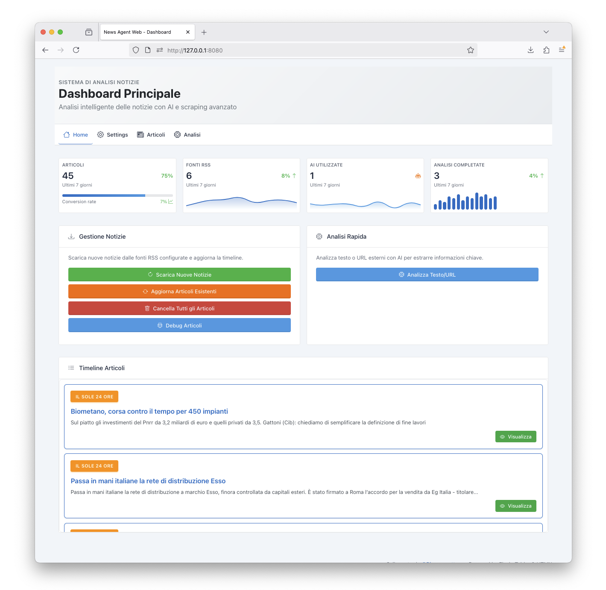
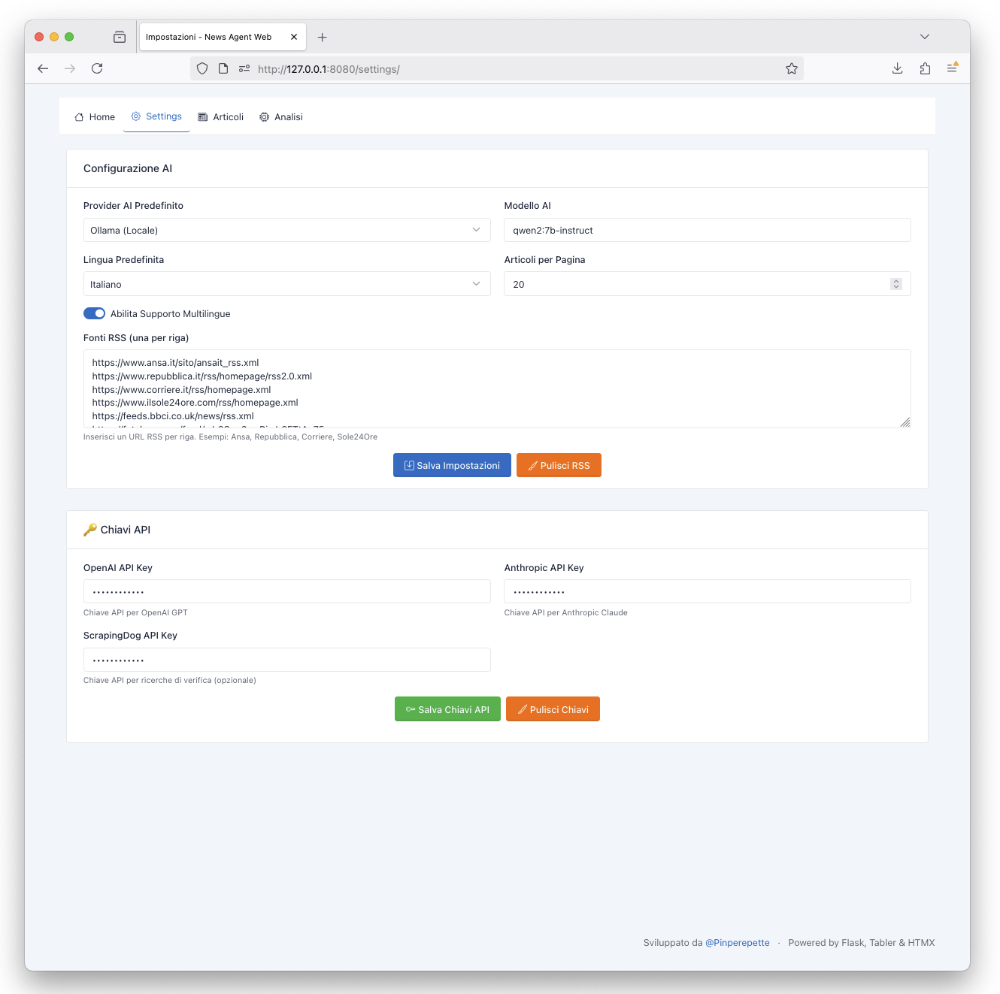
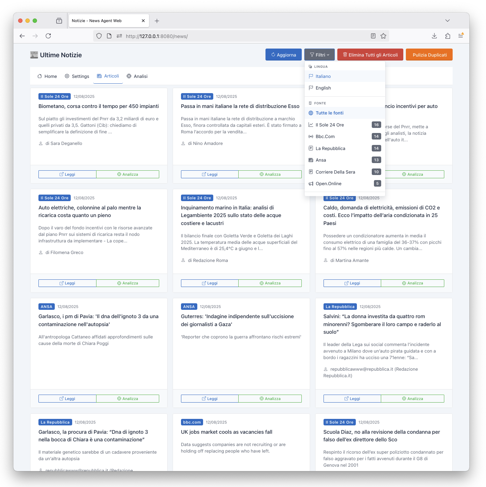
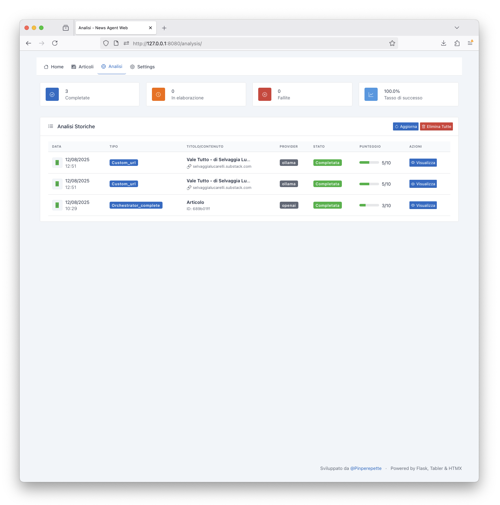
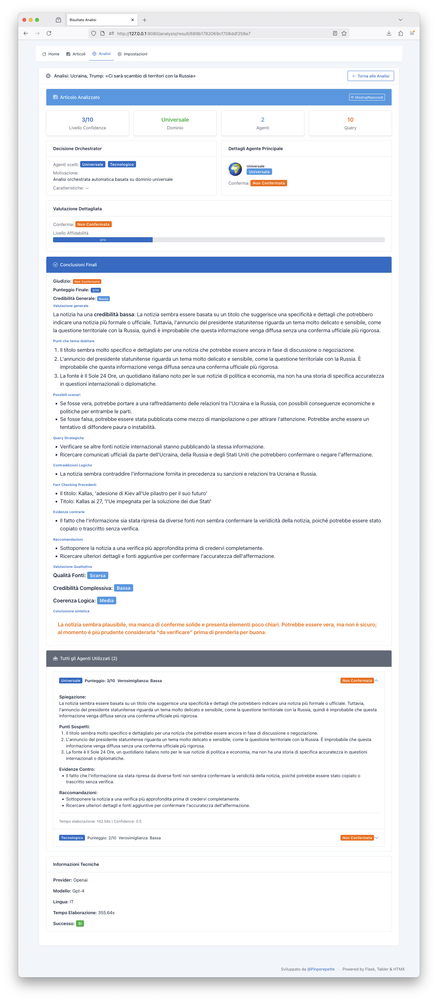

# News Agent Web

> **🚀 Transform your news consumption with AI-powered critical analysis. Think critically, verify facts, and understand the world beyond headlines.**

A modern web-based news analysis platform with AI-powered critical analysis, built with Flask, MongoDB, and HTMX.

## Features

- **📰 RSS Feed Aggregation**: Automatically fetch news from multiple RSS sources
- **🧠 AI-Powered Analysis**: Critical analysis using OpenAI, Anthropic, or local Ollama
- **🌐 Web Interface**: Modern UI with Tabler CSS and HTMX for dynamic interactions
- **📊 MongoDB Storage**: Persistent storage for articles and analysis results
- **🔧 Modular Architecture**: Blueprint-based Flask application
- **🐳 Docker Support**: Easy deployment with Docker and docker-compose
- **🔌 MCP Ready**: Basic structure and UI ready for future Model Context Protocol integration

## Screenshots







## Tech Stack

- **Backend**: Python 3.12, Flask 3
- **Database**: MongoDB (pymongo)
- **UI**: Tabler CSS (via CDN) + HTMX (zero build)
- **AI Providers**: OpenAI, Anthropic, Ollama
- **Scraping**: BeautifulSoup4, markdownify
- **RSS**: feedparser
- **Containerization**: Docker + docker-compose

## 🐳 Docker Quick Start (Recommended)

### Prerequisites
- Docker & Docker Compose
- Ollama running locally (`ollama serve`)
- MongoDB (optional - can use Docker)

### Scenario 1: You already have MongoDB and Ollama locally
```bash
git clone <your-repo>
cd news_agent_web
docker-compose up news-agent-standalone --build
```
Go to http://localhost:8080

### Scenario 2: You want MongoDB in Docker
```bash
git clone <your-repo>
cd news_agent_web
# Modify docker-compose.yml: uncomment the mongodb section
docker-compose --profile full up --build
```

### Scenario 3: Only MongoDB in Docker
```bash
docker-compose --profile mongodb-only up -d  # Only MongoDB
docker-compose up news-agent-standalone --build  # Then the app
```


---

## Setup Required Services

### Installing Ollama (Required for Local AI)

1. **Install Ollama:**
   ```bash
   # macOS/Linux
   curl -fsSL https://ollama.ai/install.sh | sh
   
   # Windows
   # Download from https://ollama.ai/download
   ```

2. **Start Ollama service:**
   ```bash
   ollama serve
   ```

3. **Download a model (optional but recommended):**
   ```bash
   ollama pull llama2:7b
   # or
   ollama pull mistral:7b
   ```

### API Keys (Optional but Recommended)

#### **OpenAI API Key (Optional)**
- **Get your key:** [https://platform.openai.com/api-keys](https://platform.openai.com/api-keys)
- **Cost:** ~$0.01-0.03 per 1K tokens
- **Models:** GPT-4, GPT-3.5-turbo

#### **Anthropic Claude API Key (Optional)**
- **Get your key:** [https://console.anthropic.com/](https://console.anthropic.com/)
- **Cost:** ~$0.0025-0.015 per 1K tokens
- **Models:** Claude 3 Haiku, Sonnet, Opus

#### **ScrapingDog API Key (Required for Web Verification)**
- **Get your key:** [https://www.scrapingdog.com/](https://www.scrapingdog.com/)
- **Cost:** $29/month for 1,000 requests
- **Why required:** Enables web search and fact verification
- **Alternative:** Free tier available for testing

**Note:** All API keys are managed through the web interface and stored securely in MongoDB.

---

## Manual Installation

### Prerequisites

### Prerequisites

- Python 3.12+
- MongoDB (or Docker)
- Ollama (optional, for local AI)

### Installation

1. **Clone the repository**
   ```bash
   git clone <repository-url>
   cd news_agent_web
   ```

2. **Install dependencies**
   ```bash
   pip install -r requirements.txt
   ```


4. **Start MongoDB** (if not using Docker)
   ```bash
   # Install and start MongoDB locally
   # Or use Docker: docker run -d -p 27017:27017 mongo:7.0
   ```

5. **Run the application**
   ```bash
   python run.py
   ```

   The application will be available at `http://localhost:8080`

### Docker Deployment

1. **Build and run with docker-compose**
   ```bash
   docker-compose up --build
   ```

2. **Access the application**
   - Web UI: `http://localhost:8080`
   - MongoDB: `localhost:27017`

## Configuration

### API Keys Management

All API keys are managed through the web interface and stored securely in the MongoDB database:

1. **Go to Settings** (`/settings`) in the web interface
2. **Configure your API keys** for the services you want to use
3. **Test the connections** to ensure everything works
4. **Keys are encrypted** and stored securely in the database

### Required vs Optional Services

- **🟢 Required:** Ollama (for local AI), MongoDB (database)
- **🟡 Recommended:** OpenAI/Claude (for better AI analysis)
- **🔴 Required for verification:** ScrapingDog (enables web search and fact-checking)

### Environment Variables (Optional)

The application uses sensible defaults for local development. For production deployment, you can configure these environment variables:

```env
# Flask Configuration
FLASK_APP=app
FLASK_ENV=production
SECRET_KEY=your-production-secret-key

# MongoDB Configuration
MONGO_URI=mongodb://your-mongodb-server:27017/news_agent_web

# Ollama Configuration
OLLAMA_BASE_URL=http://your-ollama-server:11434
```

## Usage

### 1. News Aggregation

- Navigate to `/news` to view aggregated articles
- Click "Refresh" to fetch fresh news from RSS feeds
- Filter by language (IT/EN)
- View article details and perform analysis

### 2. Critical Analysis

- **Article Analysis**: Click "Analizza" on any article
- **Text Analysis**: Use the "Analizza Testo" feature for custom content
- **URL Analysis**: Analyze articles directly from URLs
- View detailed analysis results with credibility scores

### 3. Settings Management

- Configure AI providers and models through the web interface
- Set language preferences
- Manage RSS sources
- Configure and test AI provider connections
- **API Keys**: Securely stored in MongoDB database, managed via web UI

### 4. MCP Integration (Future)

- Access MCP status at `/mcp`
- **⚠️ Currently in Development**: Filesystem, HTTP, and search adapters are stub implementations
- **🔌 Ready for Integration**: Full MCP (Model Context Protocol) support planned for future releases
- **📋 Current Status**: Basic structure and UI ready, core functionality to be implemented

## API Endpoints

### News API
- `GET /news/api/articles` - Get articles
- `GET /news/api/sources` - Get available sources
- `GET /news/fetch` - Fetch fresh news
- `GET /news/api/articles/<id>` - Get specific article

### Analysis API
- `POST /analysis/api/analyze` - Analyze article
- `POST /analysis/api/analyze-text` - Analyze custom text
- `POST /analysis/api/analyze-url` - Analyze URL
- `GET /analysis/api/analyses` - Get analysis history

### Settings API
- `GET /settings/api/settings` - Get current settings
- `POST /settings/api/settings` - Update settings
- `GET /settings/api/providers` - Get AI providers
- `POST /settings/api/test-provider` - Test provider

### MCP API
- `GET /mcp/api/status` - Get MCP status
- `POST /mcp/api/filesystem` - Filesystem operations (⚠️ Stub - not yet implemented)
- `POST /mcp/api/http` - HTTP operations (⚠️ Stub - not yet implemented)
- `POST /mcp/api/search` - Search operations (⚠️ Stub - not yet implemented)

## Architecture

```
news_agent_web/
├── app/
│   ├── blueprints/          # Flask blueprints
│   │   ├── news.py         # News management
│   │   ├── analysis.py     # Analysis features
│   │   ├── settings.py     # Configuration
│   │   └── mcp.py          # MCP adapter (stub implementation)
│   ├── models/             # MongoDB models
│   │   ├── article.py      # Article model
│   │   ├── analysis.py     # Analysis model
│   │   └── settings.py     # Settings model
│   ├── services/           # Business logic
│   │   ├── news_service.py # RSS aggregation
│   │   ├── ai_service.py   # AI providers
│   │   ├── analysis_service.py # Critical analysis
│   │   └── scraping_service.py # Web scraping
│   ├── templates/          # Jinja2 templates
│   └── static/             # Static assets
├── docker-compose.yml      # Docker configuration
├── Dockerfile             # Container definition
├── requirements.txt       # Python dependencies
└── run.py                # Application entry point
```

## Development

### Project Structure

The application follows a modular architecture:

- **Blueprints**: Separate Flask modules for different features
- **Models**: MongoDB document models with validation
- **Services**: Business logic and external integrations
- **Templates**: Jinja2 templates with Tabler CSS
- **Static**: CSS, JS, and image assets

### Adding New Features

1. **Create a new blueprint** in `app/blueprints/`
2. **Add models** if needed in `app/models/`
3. **Implement services** in `app/services/`
4. **Create templates** in `app/templates/`
5. **Register blueprint** in `app/__init__.py`

### Testing

```bash
# Run tests (when implemented)
python -m pytest

# Run with coverage
python -m pytest --cov=app
```

## Contributing

1. **Fork the repository**
2. **Create a feature branch** (`git checkout -b feature/amazing-feature`)
3. **Make your changes** and commit them (`git commit -m 'Add amazing feature'`)
4. **Add tests** if applicable
5. **Push to the branch** (`git push origin feature/amazing-feature`)
6. **Submit a pull request**

### Development Guidelines

- Follow PEP 8 style guidelines
- Add docstrings to new functions
- Test your changes locally before submitting
- Update documentation if needed

## License

This project is licensed under the MIT License - see the LICENSE file for details.

## Acknowledgments

- **Tabler**: Modern UI components and design system
- **HTMX**: Dynamic web interactions without JavaScript
- **Flask**: Python web framework
- **MongoDB**: NoSQL database
- **Ollama**: Local AI inference engine
- **OpenAI & Anthropic**: Cloud AI services
- **ScrapingDog**: Web scraping and search API

## Related Projects

- **[news_agent](https://github.com/Pinperepette/news_agent)** - CLI version with Rich terminal interface
- **news_agent_web** - Web version with Flask and modern browser interface


